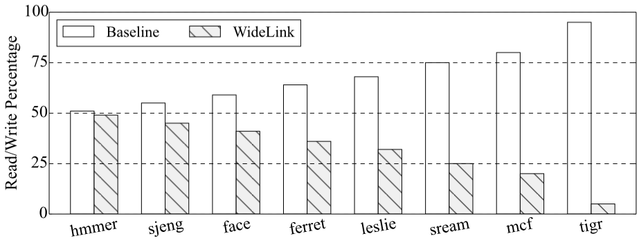
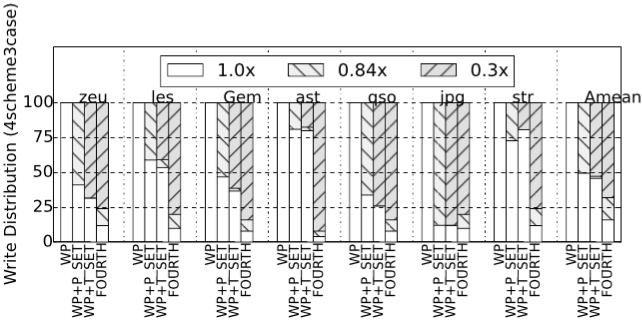
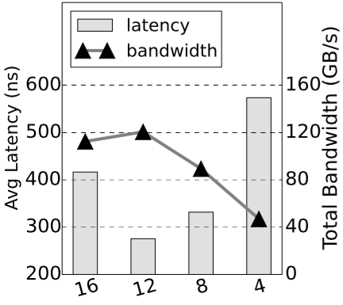
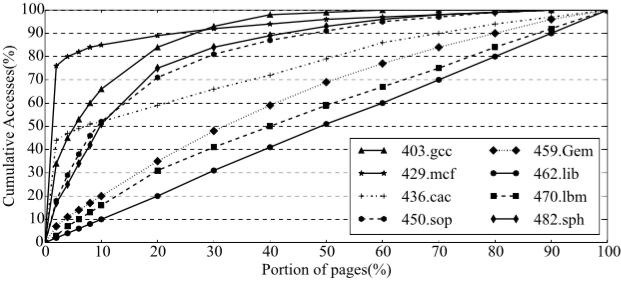
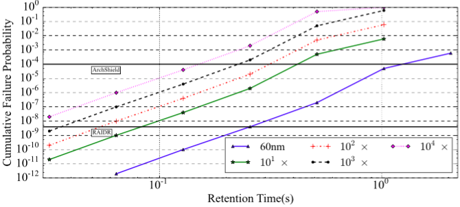
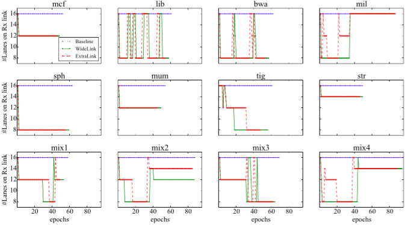
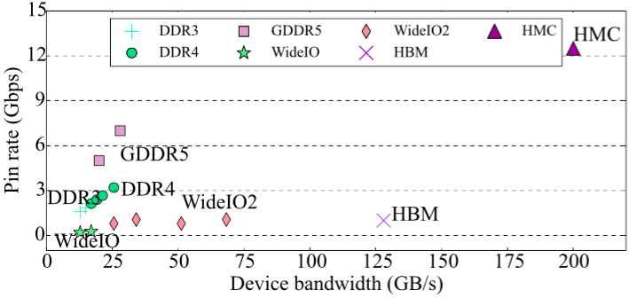
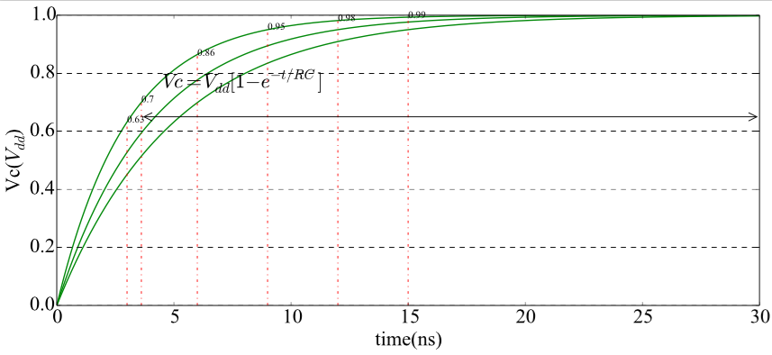

================================================================================
Creating publication-quality figures with Python
================================================================================

-------------------------------------------------------------------------------
Supported figure types: bar, stacked, scatter, line, subplot, func
-------------------------------------------------------------------------------

~~~~~~~~~~~~~~~~~~~~~~~~~~~~~~~~~~~~~~~~~~~~~~~~~~~~~~~~~~~~~~~~~~~~~~~~~~~~~~~
Xianwei Zhang / https://people.cs.pitt.edu/~xianeizhang/
~~~~~~~~~~~~~~~~~~~~~~~~~~~~~~~~~~~~~~~~~~~~~~~~~~~~~~~~~~~~~~~~~~~~~~~~~~~~~~~

.. contents::
   :local:
   :depth: 2

Workflow
============
- shell file fetches data paths
	top-level shell file **'\*.sh'** gets data file paths from cfg file **'cfgs/para.cfg'**;
- shell file scan the specified data path
	within the data path, **'\*.sh'** scans to find data file (**\*.dat**) and figure property file (**\*.cfg**);
	
- draw
	**'\*.sh'** then calls the corresponding python file to draw;
- python calling format
	python python_file data_file figure_cfg_file section_name_in_figure_cfg_file
	e.g.,
	::
	 python $PY_DIR/bar.py $data $bar_CFG_DIR/bar.cfg “read ratio figure”
- generated figure files (\*.eps/\*.png/\*.pdf, …) are saved into the data file directory;
	Note:	file name is automatically created by appending figure extension to data file
- provide the ‘\*.pdf’ (by default, \*.eps are converted to \*.pdf) file path to your latex file.
	e.g.,
	::
	 \includegraphics[width=3in]{figures/rst/DATA/{stat_energyEDP.dat}.pdf}

How to run?
----
- prepare your data in the required format (see example data files or **\*.dat.format** files;
	if you are collecting data with scripts, then it is easy to follow the format;
- write up shell file and specify data path
	edit **‘cfgs/para.cfg’** and shell file to locate your data files;
- update the figure cfg file (e.g., figure size, color, pattern and gap, etc);
	Note: 	I tried to make as many settings be not hard-coded.
	However, to avoid messy config, many others (e.g., major/minor ticks and figure dpi, etc) are still hard coded in the python files.
	If you need different settings of such parameters, then please hack the python files;
- set figure properties, e.g., height/width, pattern, color, ...
	specify which figure cfg file (**bar.cfg/stacked.cfg/y2.cfg**) to use and set the section (e.g., **"xxx figure"**) for each figure.

The top \*.sh file can be written as follow

.. code-block:: sh
	:number-lines:

	#!/bin/bash

	#-- directory of path cfg file, i.e., para.cfg
	CFG_DIR="./cfgs"
	#-- directory of python files
	PY_DIR="./pythons"

	#-- include para.cfg to specify data file path
	. $CFG_DIR/para.cfg

	scatter_CFG_DIR=$scatter_DATA_DIR #-- figure cfg file is put together with data file

	#-- scan data files in the directory
	for data in $(find $scatter_DATA_DIR -mindepth 1 -maxdepth 1 -type f -name "*.dat")
	do
		#--figure of memory comparison
		if [[ $data == *memory_comp.dat* ]]; then
			echo $data
			python $PY_DIR/scatter.py $data $scatter_CFG_DIR/scatter.cfg "memory comp figure"
		fi
		[ -f ${data}.eps ] && `epstopdf ${data}.eps && rm ${data}.eps`
	done

Example of figures 
----
Note that PNG images are for this README only, the output figure is in PDF.

- **historic bar**

- **stacked bar**

- **double y axis**

- **line**

- **log line** (axis in log scale)

- **sub plot** (multiple sub plots in one single figure)

- **scatter**

- **function plot** (plot using some curve functions instead of data samples)

Checklist
----
- **README**: this file
- **\*.figures.sh** : shell file to call python
- **pythons/**: python graph files
- **cfgs/**: data path configuration files
- **DATA/**: source data files
- **example paper/**: main figures in the paper were created with those scripts

1. historic bar
	- sh: bar.figures.sh
	- py: bar.py
	- path cfg: cfgs/para.cfg
	- draw cfg: bar.test.DATA/bar.cfg
	- data: bar.test.DATA/\*.dat
	- out: bar.test.DATA/\*.pdf

2. stacked bar
	- sh: stacked.figures.sh
	- py: stacked/stacked_[12].py
	- path cfg: cfgs/para.cfg
	- draw cfg: stacked.test.DATA/stacked.cfg
	- data: stacked.test.DATA/\*.dat
	- out: stacked.test.DATA/\*.pdf

3. double y axis
	- sh: y2.figures.sh
	- py: y2.py
	- path cfg: cfgs/para.cfg
	- draw cfg: cfgs/y2.cfg
	- data: y2.test.DATA/\*.dat
	- out: y2.test.DATA/\*.pdf

4. line (will be updated later)
	- sh: {line/log_line/subp_line}.figures.sh
	- py: {line/usual_line/log_line/subp_line}.py
	- path cfg: cfgs/para.cfg
	- draw cfg:
		| line.test.DATA/line.cfg
		| line.test.DATA/usual_line.cfg
		| log_line.test.DATA/log_line.cfg
		| subp_line.test.DATA/subp_line.cfg
	- data: \*.test.DATA/\*.dat
	- out: \*.test.DATA/\*.pdf

5. func (will be improved later)
	- sh: func.figures.sh
	- py: func/{leak/rc/tret_20nm/tret_60nm}.py
	- path cfg: cfgs/para.cfg
	- draw cfg: func.test.DATA/{leak/rc/tret}.cfg
	- data: func.test.DATA/\*.dat
	- out: func.test.DATA/\*.pdf
